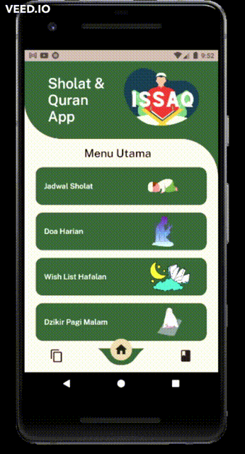
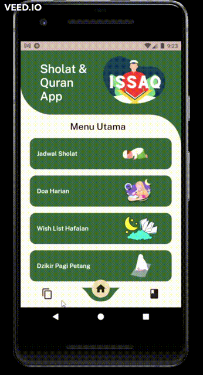
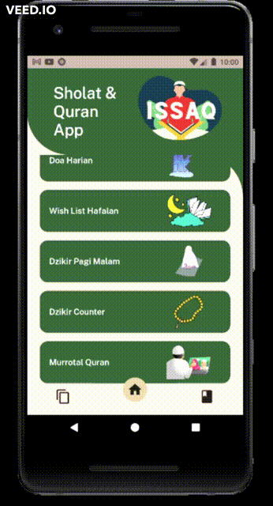

# ISSAQ (Information System Shola and Quran) 

Jadi ini merupakan aplikasi yang melingkup seputar agama islam seperti informasi Sholat, Pembacaan Alquran, Doa, Artikle dan Lainnya.

## Pendahuluan

Pada project aplikasi ini saya menggunakan flutter sebagai framework dan bahasa pemograman dart sebagai back-end nya. serta ada beberapa sumber lain sebagai artikle, quran, sholat maupun lainnya. untuk menjalankan aplikasi ini diperlukan beberapa installasi software untuk pengembangannya. Adapula fitur pada aplikasi kami adalah seperti wishlist (yang ingin dihafalkan, note, maupun lainnya yang dihubungkan dengan sqlflite), halaman quran (untuk membaca quran), murrotal quran (pembaca quran dalam bentuk suara dengan berbagai imam yang dihubungkan dengan API), jadwal sholat (Hanya untuk wilayah malang saja sementara ini dengan menggunakan liblary pada pub.dev), home screen (sebagai menu navigasi), halaman dzikir (tampilan pembaca dzikir beserta artinya), penghitung dzikir (digunakan untuk counter atau penghitung dzikir beserta urutannya), doa harian (doa yang dapat dibaca sesuai peruntukannya beserta artinya), artikel (pembaca artikel yang masih dalam bentuk model saja) 

### Installasi 

1. Melakukan penginstalan chocolatey : https://chocolatey.org/install
2. Melakuan pengintalan dart sebagai berikut di-CMD:
   ```
   C:\src>choco install dart-sdk
   C:\src>choco upgrade dart-sdk
   ```
      - In the Windows search box, type env.
      - Click Edit the system environment variables.
      - Click Environment Variables….
      - In the user variable section, select Path and click Edit…. 
      - Click New, and enter the path to the dart-sdk directory.
      - In each window that you just opened, click Apply or OK to dismiss it and apply the path change
3. Melakukan Penginstalan Flutter SDK : https://flutter.dev/docs/get-started/install
  ```
  C:\src>git clone https://github.com/flutter/flutter.git -b stable
  ```
4. Melakukan Run
 ```
C:\src>flutter doctor
C:\src>flutter run

```
5. Melakukan Installasi Plugins pada VSCode atau pada Android Studio

## Demo Aplikasi GIF

### Home Screen & Quran Page

   

### Artikel Page & Jadwal Sholat

   

### Doa Harian & Wishlist Page

   
   
### Dzikir Page & Dzikir Counter

   
   
### Murrotal Quran


### Penjelasan

1. Demo Home Screen & Quran Page

* Gambar 1 = Tampilan dari homescreen dengan tampilan menggunakan bottom navbar
* Gambar 2 = Tampilan quran dengan bentuk berupa listview dengan menggunakan API

2. Demo Artikel Page & Jadwal Sholat

* Gambar 1 = Tampilan dari artikel dengan penggunaan list view dan base menggunakan model yang dibuat dari refrensi internet yang ada
* Gambar 2 = Tampilan Jadwal Sholat dengan penggunaan liblary yang diambil pada pub.dev flutter

3. Demo Doa Harian & Wishlist Page

* Gambar 1 = Tampilan dari doa harian dengan mengguankan list view stack / grid dengan sumber menggunakan model
* Gambar 2 = Tampilan Wishlist Page dengan menggunakan back end sqflite yang disimpan secara lokal

4. Demo Dzikir Page & Dzikir Counter
* Gambar 1 = Tampilan Dzikir Page dengan mengguankan model yang telah dibuat dengan refrensi internet yang ada
* Gambar 2 = Tampilan Dzikir Counter terdapat keterangan diatas dapat dilakukan penambahan maupun pengurangan pada counternya

5. Demo Murrotal Quran
* Gambar 1 = Tampilan Murrotal Quran dengan fitur play, pause, rewind,forward, dan backward. Dapat pula dilakukan pemilihan qori yang membaca serta surat yang ingin diputar 

## Postponed Features

* Video Player digantikan dengan Murrotal Quran
* Terjemahan Quran (API masih belum ada yang cocok)
* Fitur Wishlist masih lokal menggunakan sqflite

## IDENTITAS DIRI
```
FARIS IKHLASUL HAQ
07 / 1941720062
HISYAM HARYO MAHDYAN
10 / 1941720186
IRFAN THALIB ALFARID
11 / 1941720039
```
## DOSEN PENGAMPU
```
Dian Hanifudin Subhi, S.Kom., M.Kom.
https://github.com/dhanifudin
```
## JURUSAN TEKNOLOGI INFORMASI


