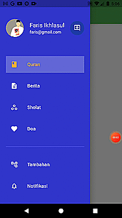
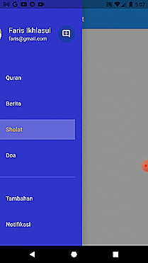
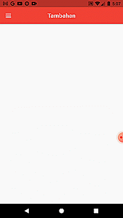
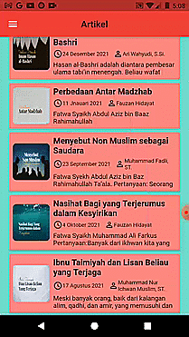
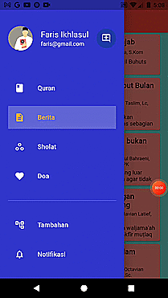
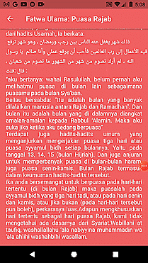
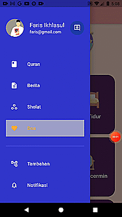
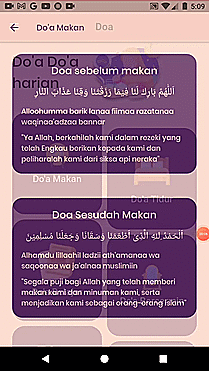

# ISSAQ (Information System Shola and Quran)

Jadi ini merupakan aplikasi yang melingkup seputar agama seperti informasi Sholat, Pembacaan Alquran, Doa, Artikle dan Lainnya.

## Pendahuluan

Pada project aplikasi ini saya menggunakan flutter sebagai framework dan bahasa pemograman dart sebagai back-end nya. serta ada beberapa sumber lain sebagai artikle maupun lainnya. untuk menjalankan aplikasi ini diperlukan beberapa installasi software untuk pengembangannya.
serta pada project aplikasi ini juga adalah lebih berfokus pada Perpindahan Page dan List. Saya disini menggunakan *PAGE BERITA ARTIKLE* dan *PAGE DOA*

### Installasi

1. Melakukan penginstalan chocolatey : https://chocolatey.org/install
2. Melakuan pengintalan dart sebagai berikut di-CMD:
   ```
   C:\src>choco install dart-sdk
   C:\src>choco upgrade dart-sdk
   ```
      - In the Windows search box, type env.
      - Click Edit the system environment variables.
      - Click Environment Variables….
      - In the user variable section, select Path and click Edit…. 
      - Click New, and enter the path to the dart-sdk directory.
      - In each window that you just opened, click Apply or OK to dismiss it and apply the path change
3. Melakukan Penginstalan Flutter SDK : https://flutter.dev/docs/get-started/install
  ```
  C:\src>git clone https://github.com/flutter/flutter.git -b stable
  ```
4. Melakukan Run
 ```
C:\src>flutter doctor
C:\src>flutter run

```
5. Melakukan Installasi Plugins pada VSCode atau pada Android Studio

## Demo Aplikasi GIF

### Demo Sidebar Perpindahan Antar Page

   
   
   


### List View Pada Page Artikel

   
   


### List View Pada DOA dan Pergantian Page

   


### Penjelasan

1. Demo Sidebar Perpindahan Antar Page

* Gambar 1 = Menu awal akan diawali oleh Sidebar Quran yang akan dilarikan ke Page Quran
* Gambar 2 = Perpindahan dari Page Artikle ke Sholat
* Gambar 3 = Perpindahan dari Page Sholat ke Doa
* Gambar 4 = Perpindahan dari Page Tambahan ke Notifikasi

2. List View Pada Page Artikel

* Gambar 1 = List View berjumlah 10 dan dapat berpindah page dengan adanya pemilihan data melalui detail_artikle.dart menggunakan model yang telah dibuat
* Gambar 2 = Mencoba membuka salah satu artikle
* Gambar 3 = Melakukan Scroll dan membuka random artikle lainnya

3. List View Pada DOA dan Pergantian Page

* Gambar 1 = Menekan  Page doa dan akan menampilkan 8 data model yang telah dibuat dengan berbentuk list cardview
* Gambar 2 = Melakukan Klik random salah satu opsi model yang telah dibuat

## In Progress dan Error Saat pengerjaan

1. Pembuatan Login dan Register yang masih tahap inprogress karena terjadi kesalahan pada saat pembuatan yaitu error AppMapDebug
2. Kendala splashcreen yang gambarnya tidak dapat muncul

## IDENTITAS DIRI

FARIS IKHLASUL HAQ
TI 3A / 07
1941720062

## DOSEN PENGAMPU
Dian Hanifudin Subhi, S.Kom., M.Kom.
https://github.com/dhanifudin


## JURUSAN TEKNOLOGI INFORMASI

